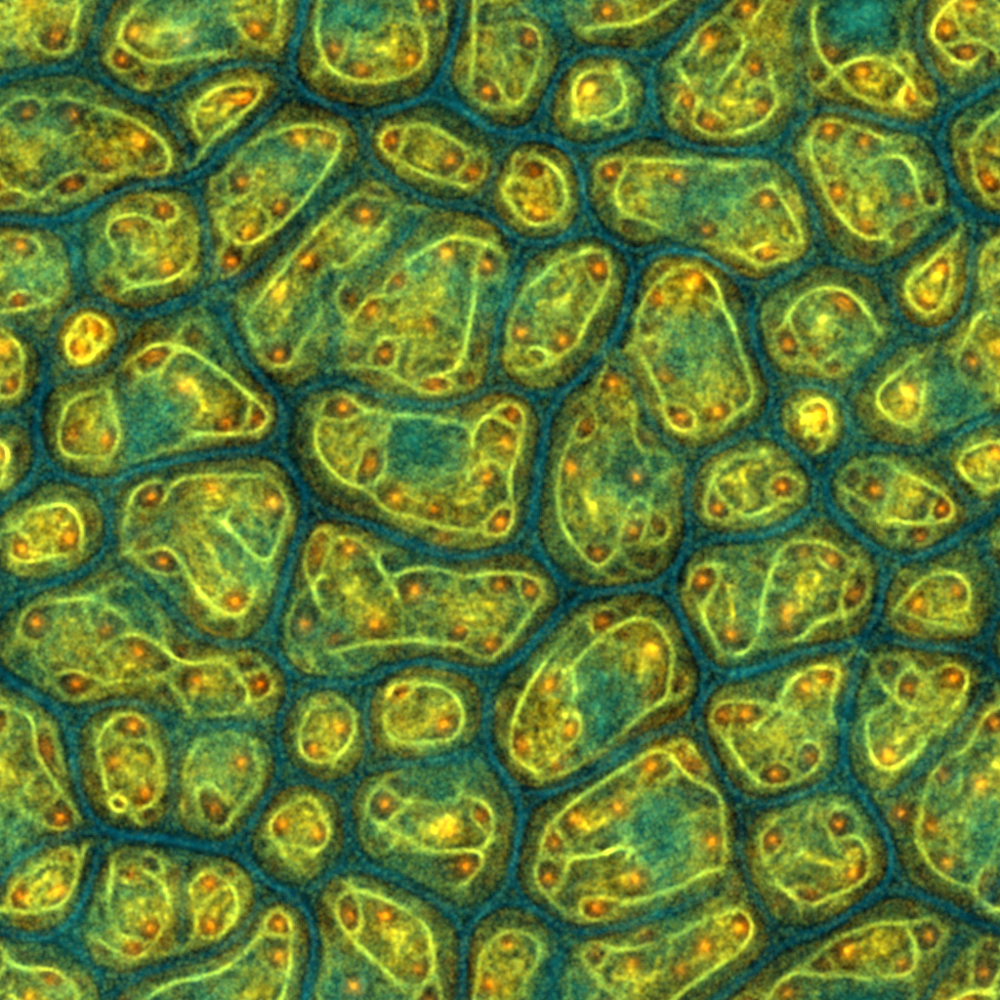
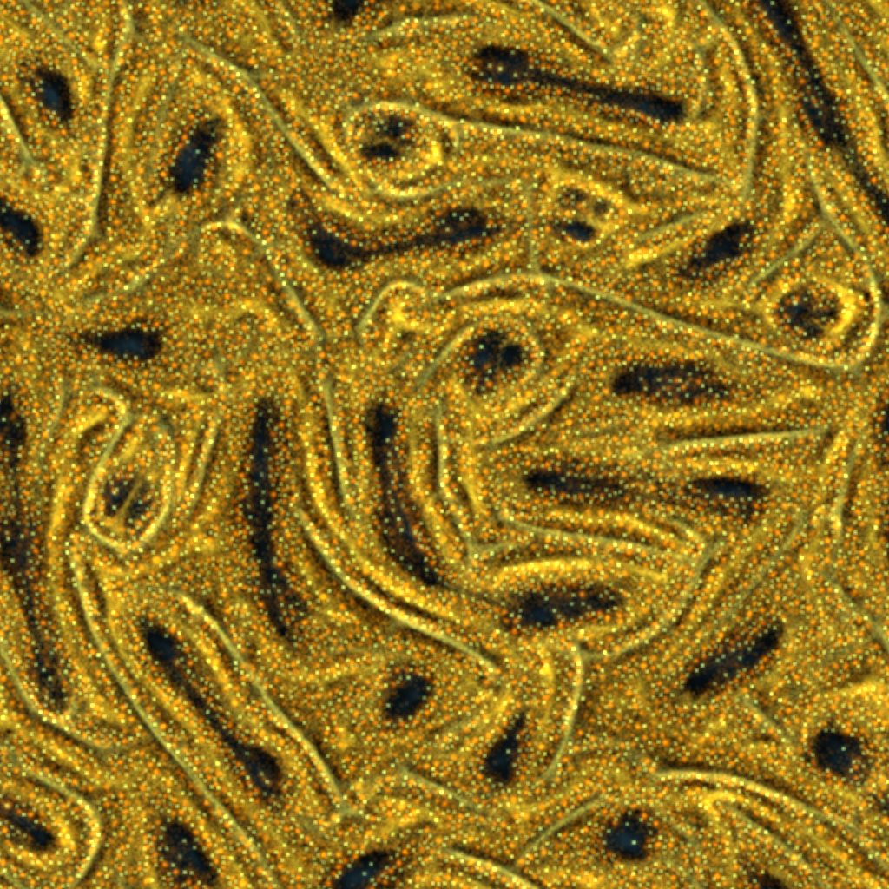
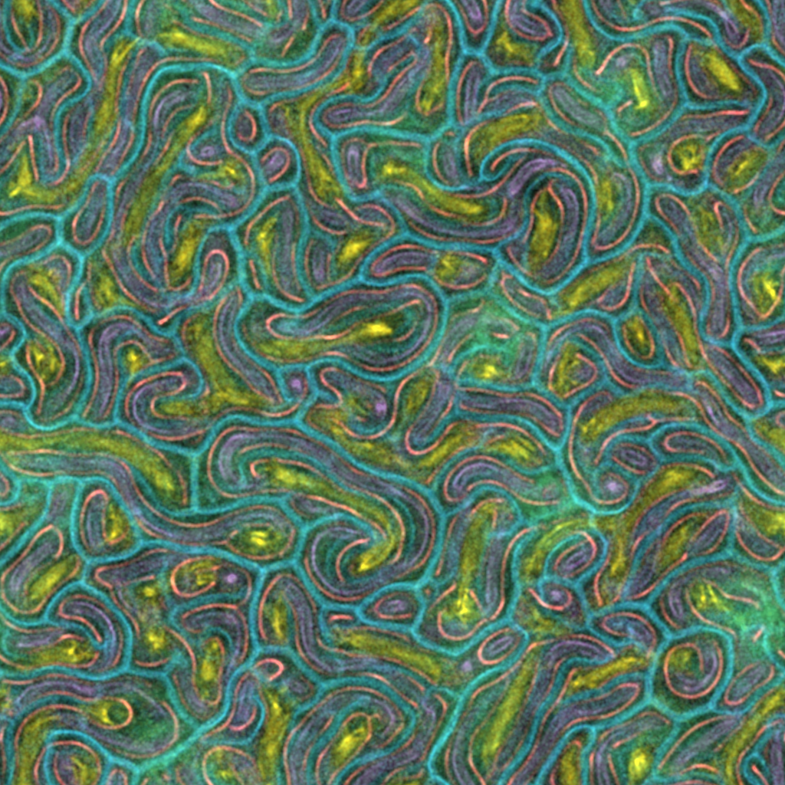
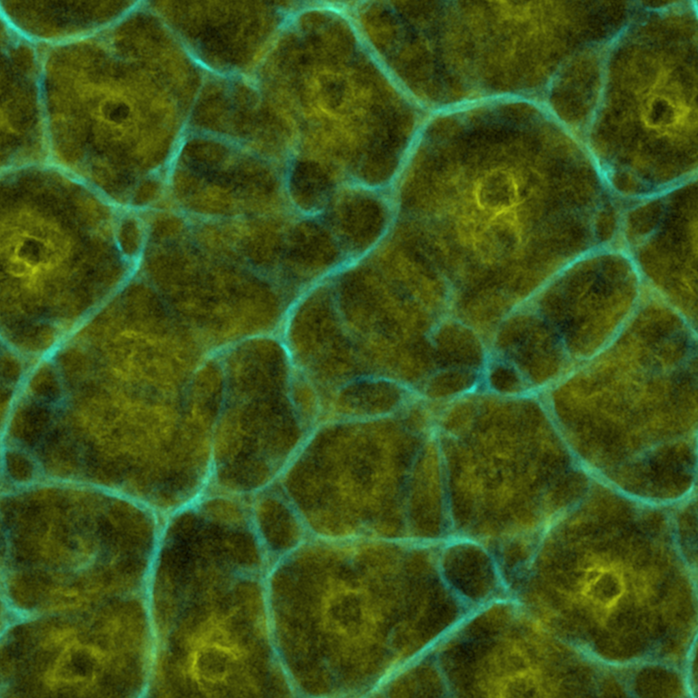
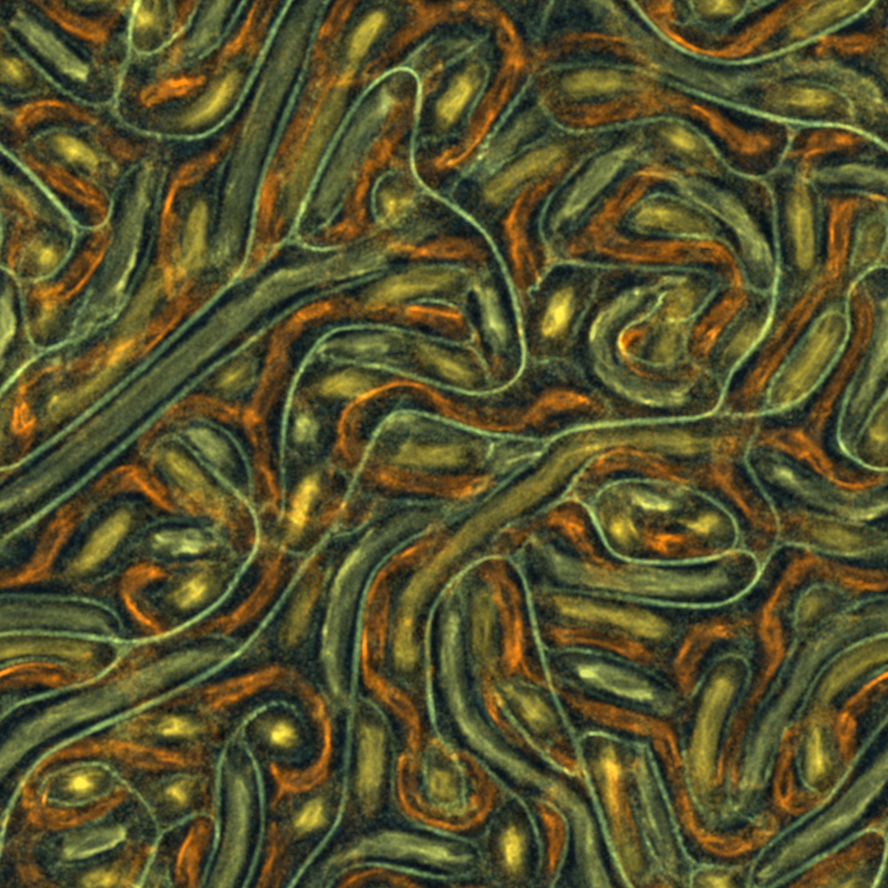

# Physarum Util

A command line tool to generate Physarum Transport Networks with [fogleman/physarum](https://github.com/fogleman/physarum).

## Installation

First install go and then install and clone physarum-util.

```bash
go get -u github.com/piebro/physarum-util
git clone git@github.com:piebro/physarum-util.git
cd physarum-util
```

## Usage

Run the basic setup with default values.

```bash
go run main.go -size 1024 -path random/random_%d.png --logPath "random.log"
```

If the logPath is set, the setting to generate similar images is saved in the log file. You can use it like this:

```bash
go run main.go -size 1024 -path 1024/1024_%d.png --configLogPath "examples.log" --configsLike "examples/random_133621388.png" -numOfExamples 5
```

You can also manually set all options and generate images like this:

```bash
go run main.go -size 1024 -path 1024/1024_%d.png -zoom 1 -blurPasses 2 -blurRadius 1 -config "Config{0.593197, 44.885075, 0.24494606, 0.6983911, 5, 0.1},Config{1.4062264, 1.4197627, 1.9218088, 0.22434194, 5, 0.1},Config{1.5296767, 57.531967, 0.7028523, 1.314878, 5, 0.1}" -color "#E27A3F #45B29D #334D5C" -numOfExamples 5
```

You can can see all Options with ```go run main.go --help```.

## Example images











## High Resolution Images

For printing high resolution images are handy. You can look for a setting you like in a lower resolution and then use:

```bash
go run main.go -size 4096 -path 4096/4096_%d.png -configLogPath "examples.log" -configsLike "examples/random_133621388.png" -numOfExamples 1 -particlesPowerOfTwo 26 -blurRadius 4
```

The taget resolution needs to be a multiple of 2. For a high resolution images more particles and a bigger blur radius is needed to make it look like the low resolution image.
